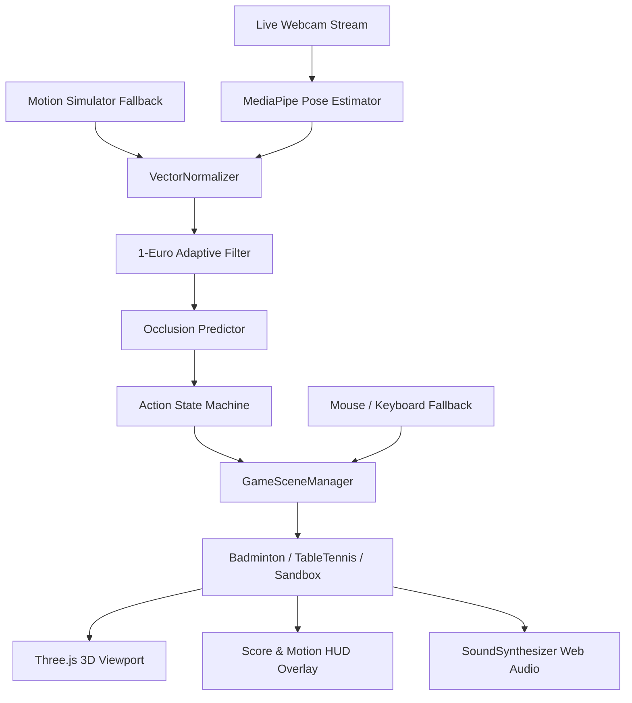

# Implementation Plan: CamArena Motion Tracking Sports Platform & Gameplay Realism

## Overview
**CamArena** is a high-performance web-based athletic motion tracking sports platform built with **HTML5, TypeScript, Three.js, MediaPipe Pose, and Web Audio API**. It supports **Badminton 3D**, **Table Tennis 3D**, and a **Motion Mirror & Biomechanical Calibration Sandbox**.

This document details the complete technical architecture, gameplay physics, equipment rendering, pause & scoring systems, camera projections, user experience overhauls, and control fallbacks.

---

## Architecture & System Design

### 1. System Pipeline

### 2. Core Components

1. **`PoseTracker.ts`**:
   - Manages MediaPipe Pose detection (33 landmarks, metric coordinates).
   - Dynamic mode switching: `live` webcam vs. `synthetic` athletic motion generator (60 FPS sinusoidal arm and torso trajectories).
   - Dispatches `MotionFrame`, `ActionEvent`, and `GesturePause` events.

2. **`VectorNormalizer.ts`**:
   - Normalizes joint telemetry relative to the mid-hip and torso root.
   - Computes an invariant orthonormal basis ($\vec{u}_{\text{right}}, \vec{u}_{\text{up}}, \vec{u}_{\text{forward}}$) preventing coordinate collapse during deep lunges, reach extensions, and body turns.

3. **`OneEuroFilter.ts` & `OcclusionPredictor.ts`**:
   - Dynamic cut-off filtering ($f_c = f_{c,min} + \beta |\dot{x}|$) eliminating jitter during resting poses while preventing latency during rapid smashes.
   - Kinematic momentum dead-reckoning during temporary limb occlusions.

4. **`Avatar3D.ts` & Equipment Rendering**:
   - Dynamic procedural 3D equipment rendering:
     - **Badminton**: High-visibility cyan alloy racket head, carbon shaft, ergonomic grip, and white string mesh.
     - **Table Tennis**: Dual-color tournament paddle (red forehand rubber, black backhand rubber, flared wooden handle).
   - Racket/paddle dynamically attaches to dominant hand wrist/index landmark with forward-facing orientation.
   - `getRacketWorldPosition()` calculates exact 3D blade center for physical projectile collision detection.
   - **Ghost Silhouette Mode**: Optional `0.28` opacity rendering so the player's own avatar never obstructs incoming balls/shuttles.

5. **`GameSceneManager.ts`**:
   - Standardized scene lifecycle contract: `init`, `start`, `update`, `onAction`, `onResize`, `destroy`.
   - Manages opponent modes (`system` AI, `pvp` 2-player, `practice`), difficulty tiers (`casual`, `pro`, `legend`), and target match points (11 or 21).
   - Pauses simulation physics while maintaining live webcam skeleton tracking.
   - Smooth scene transitions (`fading-out` / `fading-in`) preventing visual pops.

---

## Detailed Feature Implementation

### 1. Routing & Main Menu Flow
- **Main Menu First**: Application boots directly into the full-screen glassmorphic Main Menu overlay (`z-index: 300`).
- **Interactive Match Setup**:
  - Sport selection cards (Badminton 3D, Table Tennis 3D, Motion Sandbox).
  - Opponent configuration: System AI, PvP (2-Player), or Solo Practice.
  - Match length toggle: 11 Points (Quick Match) or 21 Points (Official Tournament) with Win-by-2 rules.
  - AI difficulty level: Casual (wider hitboxes, relaxed speed), Pro (fast rallies), Legend (tight angles, power smashes).
  - Controller mode: Live Webcam or Synthetic Motion Simulator.
- Clean tear-down and state reset when returning to the main menu at any point.

### 2. Dual Controls: Full-Body Pose + Mouse/Keyboard Fallback
- **Webcam Tracking**:
  - Live full-body tracking mapped to player position.
  - Overhead swings trigger Smashes; forward snaps trigger Drives; low upward sweeps trigger Lifts.
- **Mouse & Keyboard Fallback**:
  - `mousemove`: Smoothly moves racket/paddle across the table/court (X: lateral, Y: vertical elevation).
  - `click` or `Space`: Swings racket/paddle and initiates serves.
  - `Arrow Keys` / `WASD`: Incremental footwork positioning (±0.55m).
  - `C` key or `🎥 View` button: Cycles camera perspective presets (`court_level`, `broadcast`, `over_shoulder`).

### 3. Fair Serve & Guidance System
- **Player Serve**:
  - Shuttlecock/ball hovers next to the player's racket/paddle awaiting player action.
  - Vibrant cyan pulsating banner: `🏸 YOUR SERVE — Click or press SPACE to serve!`.
  - No premature auto-serves; player serves strictly when ready.
- **AI Serve**:
  - 2.0–2.5 second fair warning countdown with alert banner: `🤖 OPPONENT SERVING — Get ready!`.
  - Banner dismisses immediately once ball/shuttle is hit.

### 4. Realistic Projectile Physics & Collision
- **Quadratic Drag & Flight**:
  - Badminton shuttlecock exhibits authentic badminton aerodynamics: initial high speed tapering into steep quadratic deceleration before dropping.
  - Table tennis ball utilizes ITTF restitution coefficients ($e \approx 0.88$), gravity, and top/back spin curve forces.
- **High-Visibility Visual Trails**:
  - Multi-segment neon trail meshes with decaying opacity for clear visual trajectory tracking.
- **Physical Racket & Bat Proximity Interception**:
  - Every frame checks 3D Euclidean distance between projectile and racket head (`distToRacket < 1.0m` in player court).
  - Auto-intercepts return trajectory based on bat angle and swing velocity, preventing projectiles phasing through player equipment.
- **Net Collision & Audio/Visual Cues**:
  - Physical boundary detection on net mesh with momentum damping.
  - Cues: Red pulsating `⛔ HIT NET!` banner with entry flash animation (`@keyframes netHitFlash`) and Web Audio thud synthesis.

### 5. Transparent Scoring, Pause & HUD Overlay
- **Pause & Resume**:
  - Dedicated on-screen `⏸ Pause` button, `Esc`/`P` keyboard shortcuts, and "raise both hands" gesture pause.
  - Freezes 3D simulation clock while keeping live camera mirror active.
  - Pause modal options: **Resume**, **Restart Match**, **Main Menu**, **Rules Guide**.
- **Scoreboard HUD**:
  - High-contrast glassmorphic backdrop (`backdrop-filter: blur(24px)`).
  - Bold `3.4rem` score numbers (Cyan for Player, Magenta for Opponent).
  - Live rally hit counter, serving indicator, match point alert banner (`#fbbf24`), and official rules summary.
  - Victory/Defeat modals on reaching match score (with win-by-2 margin requirement).

---

## Verification Plan

### Automated Tests
- `npm run build` (`tsc && vite build`) with strict TypeScript mode.

### Manual & Subagent Testing Checklist
- [x] Application boots directly into Main Menu; no auto-launching.
- [x] Selecting sport, mode, difficulty, and target score initializes the correct scene.
- [x] Live webcam mirror or motion simulator skeleton renders continuously without errors.
- [x] Serve guidance banner prompts the player to serve with click or spacebar.
- [x] Physical collision reliably catches incoming balls/shuttles.
- [x] Net hits trigger visual banner and point termination.
- [x] Camera view switches across presets via button and `C` key.
- [x] Pause menu freezes match physics; resume restores gameplay; Main Menu returns cleanly without residual modal leaks.
